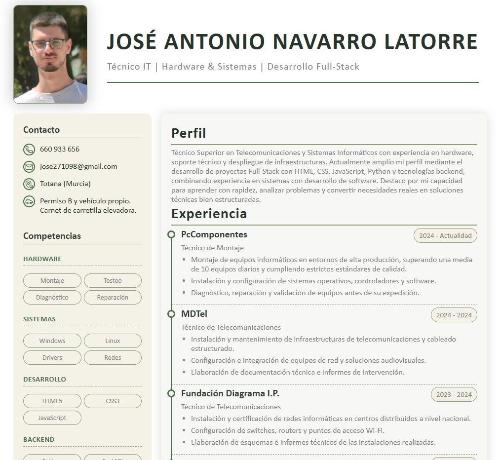

# CV Web Responsive

Currículum web desarrollado desde cero con **HTML5 y CSS3**, diseñado con un enfoque profesional y orientado tanto a visualización en navegador como a impresión en PDF.

## Características

- HTML5 semántico y accesible
- CSS organizado mediante componentes reutilizables
- Sistema de variables CSS para una gestión consistente del diseño
- Layout construido con Flexbox y CSS Grid
- Timeline creada con pseudoelementos (`::before` y `::after`)
- Iconografía SVG integrada mediante `currentColor`
- Diseño optimizado para impresión en PDF
- Arquitectura preparada para responsive *(en desarrollo)*

## Tecnologías

- HTML5
- CSS3
- Flexbox
- CSS Grid
- SVG
- Media Queries

## Objetivos del proyecto

Este proyecto forma parte de mi proceso de aprendizaje en desarrollo Frontend. Durante su desarrollo he trabajado conceptos como:

- Maquetación semántica
- Componentes reutilizables
- Organización y arquitectura CSS
- Variables CSS
- Pseudoelementos
- Diseño para impresión (`@media print`)
- Responsive Design

## Próximas mejoras

- Adaptación completa para dispositivos móviles
- Animaciones e interacciones sutiles
- Enlaces a GitHub, LinkedIn y proyectos
- Optimización del código y mejoras de accesibilidad